# Mini Catalog

**Mini Catalog**, Flutter ile geliştirilmiş, modern ve kullanıcı deneyimi odaklı bir e-ticaret/katalog uygulamasıdır. Bu proje, temel bir katalog uygulamasının ötesine geçerek; güvenli kimlik doğrulama, yerel veri kalıcılığı ve gelişmiş filtreleme mekanizmaları gibi profesyonel özellikleri barındırır.

## Özellikler

- **Güvenli Kimlik Doğrulama:** SHA-256 algoritması ile hash'lenmiş şifreleme altyapısına sahip Kayıt (Register) ve Giriş (Login) sistemi.
- **Kalıcı Veri Depolama:** `SharedPreferences` entegrasyonu ile kullanıcı hesapları, favoriler ve ayarlar cihaz hafızasında güvenle saklanır.
- **Akıllı Arama & Filtreleme:** Ürün ismi üzerinden anlık (real-time) arama yapabilen yüksek performanslı arama motoru.
- **Kişiselleştirilmiş Favoriler:** Her kullanıcının kendi profiline özel, birbirinden bağımsız favori listesi yönetimi.
- **Gelişmiş Sepet Yönetimi:** Ürün adedi kontrolü, dinamik toplam fiyat hesaplama ve profesyonel Checkout (Ödeme) simülasyonu.
- **Profil Paneli:** Kullanıcıya özel şifre değiştirme, hesap silme ve güvenli çıkış (Logout) işlemleri.

## Teknik Mimari ve Paketler

Proje, endüstri standartlarına uygun paketler ve temiz bir kod mimarisi (Clean Code) ile geliştirilmiştir:

1.  **`crypto`**: Kullanıcı şifrelerinin güvenliğini sağlamak için SHA-256 hash mekanizması oluşturulmuştur.
2.  **`shared_preferences`**: Uygulamanın bir veritabanı gibi davranmasını sağlayarak verilerin kalıcı (persistent) olmasını sağlar.
3.  **`material`**: Modern ve akıcı bir kullanıcı arayüzü sunmak için Google'ın Material Design bileşenleri kullanılmıştır.

## Ön Koşullar ve Geliştirme Ortamı

Projeyi çalıştırmadan önce sisteminizde aşağıdakilerin kurulu olduğundan emin olun:
- **Flutter SDK** (sürüm 3.x.x)
- **VS Code** (Flutter ve Dart eklentileri yüklenmiş)
- **Android Studio** (Emülatör/AVD kurulumu için gereklidir. Cihaz yöneticisinden en az bir adet sanal cihaz oluşturulmuş olmalıdır.)

### VS Code Üzerinden Emülatörü Başlatma
Eğer Android Studio yerine VS Code kullanıyorsanız, sanal cihazı (emülatörü) şu şekilde başlatabilirsiniz:
1. VS Code'u açın.
2. `Ctrl + Shift + P` tuşlarına basarak komut paletini açın.
3. Arama çubuğuna `Flutter: Launch Emulator` yazın ve Enter'a basın. Bir android cihaz indirmiş olmanız gerekir.
4. Çıkan listeden önceden oluşturduğunuz Android emülatörünü seçin.

## Kurulum ve Çalıştırma

Projeyi yerel ortamınıza indirmek ve bağımlılıkları kurmak için terminalinizde şu adımları izleyin:

```bash
git clone https://github.com/XFGQ/Mini-Catalog-with-Flutter.git
cd Mini-Catalog-with-Flutter
flutter pub get
```

### Windows
Windows ortamında uygulamayı test etmek için iki seçeneğiniz bulunmaktadır:

**1. Android Emülatöründe Çalıştırmak:**
*(Önce yukarıdaki adımlarla emülatörü başlatın)*
```bash
flutter run
```

**2. Yerel Windows Masaüstü Uygulaması Olarak Çalıştırmak:**
```bash
flutter run -d windows
```

### Linux İçin
Linux ortamında uygulamayı test etmek için iki seçeneğiniz bulunmaktadır:

**1. Android Emülatöründe Çalıştırmak:**
*(Önce yukarıdaki adımlarla emülatörü başlatın)*
```bash
flutter run
```

**2. Yerel Linux Masaüstü Uygulaması Olarak Çalıştırmak:**
*(Not: Sisteminizde `clang`, `cmake`, `ninja-build`, `pkg-config`, `libgtk-3-dev` kurulu olmalıdır)*
```bash
flutter run -d linux
```
### Android Build için

**1. Terminali açın**
```bash
flutter build apk
```
**2. apk. dosyasını build>app>outputs>flutter-apk dosya dizininde bulabilirsiniz**

**-**

## Ekran Görüntüleri

Uygulamanın tüm ekranlarına ve detaylı özelliklerine ait görüntüler aşağıda kategorize edilmiştir:

### Kimlik Doğrulama (Auth)
| Giriş Ekranı | Kayıt Ekranı |
| :---: | :---: |
| 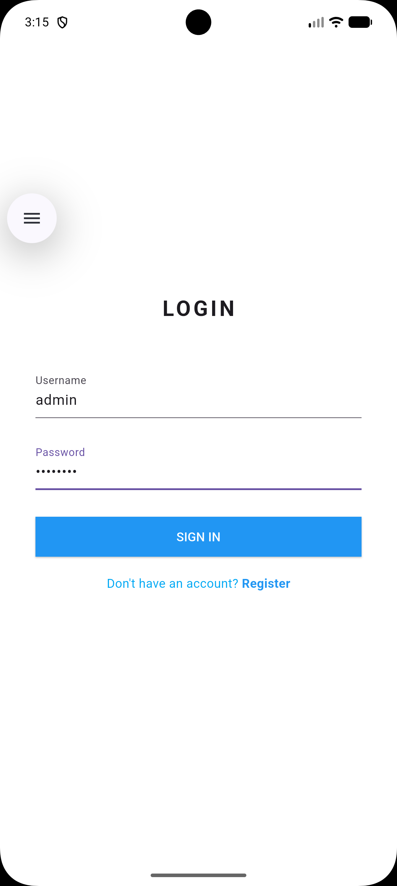 | 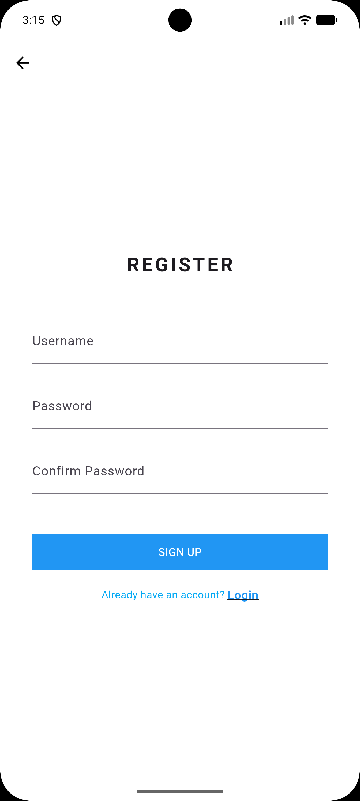 |

### Ana Sayfa ve Arama (Home & Search)
| Ana Sayfa | Ana Sayfa (Alternatif) | Arama Metodu |
| :---: | :---: | :---: |
| 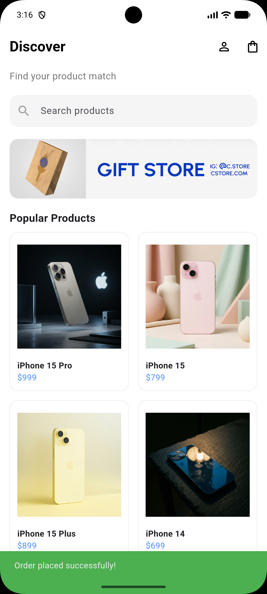 | 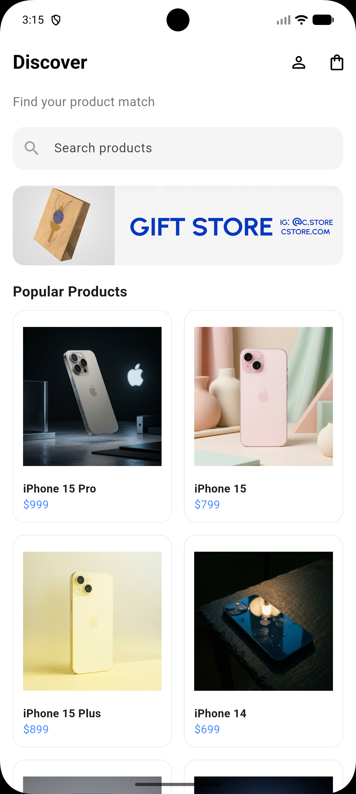 | 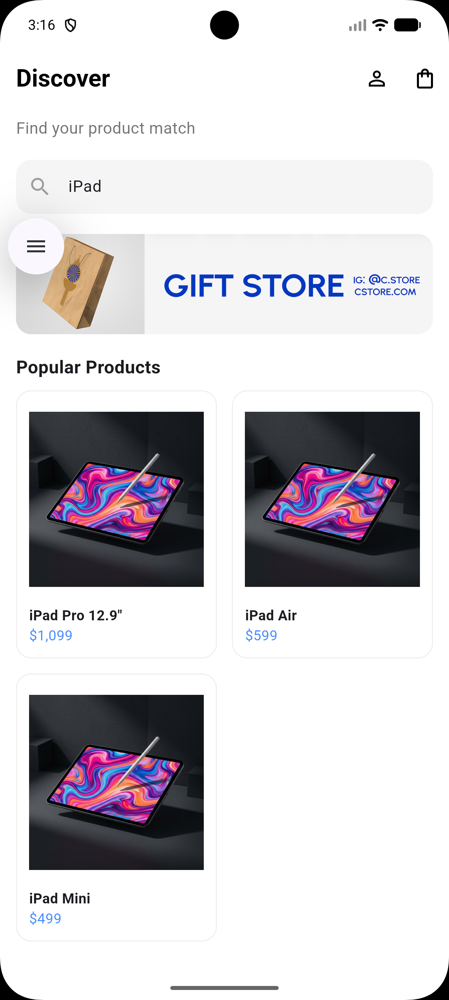 |

### Ürün Detayları (Detail)
| Ürün Detay | Ürün Detay - Özellikler | Ürün Detay - Sepete Ekleme |
| :---: | :---: | :---: |
| 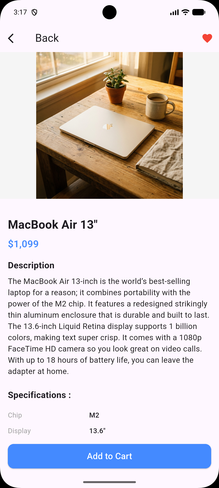 | 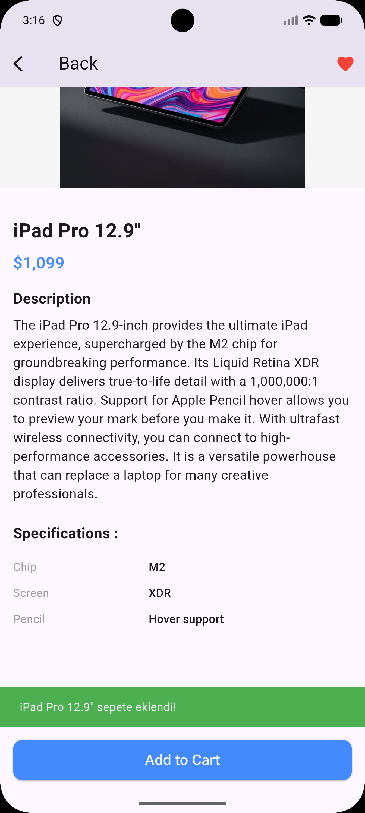 | 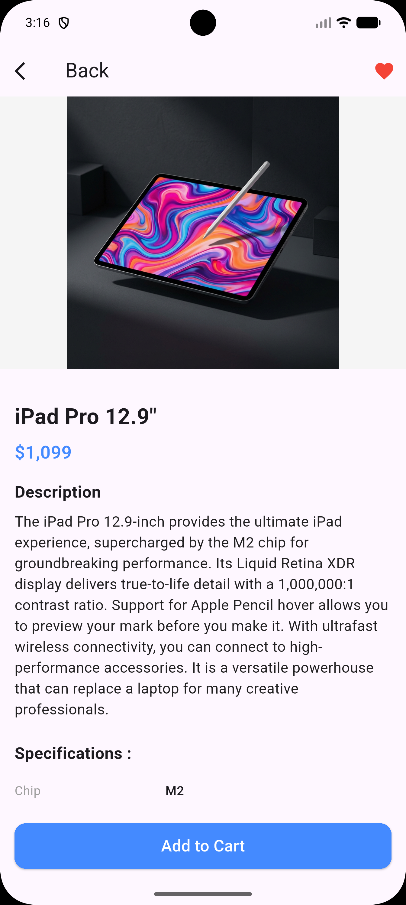 |

### Sepet ve Favoriler (Cart & Favorites)
| Sepet | Favoriler | Favoriler (Alternatif) |
| :---: | :---: | :---: |
| 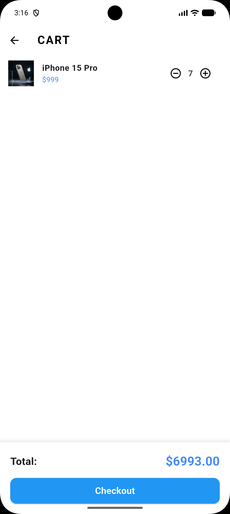 | 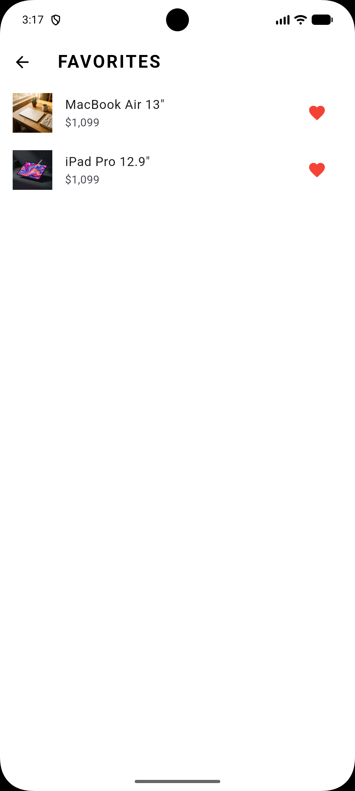 | 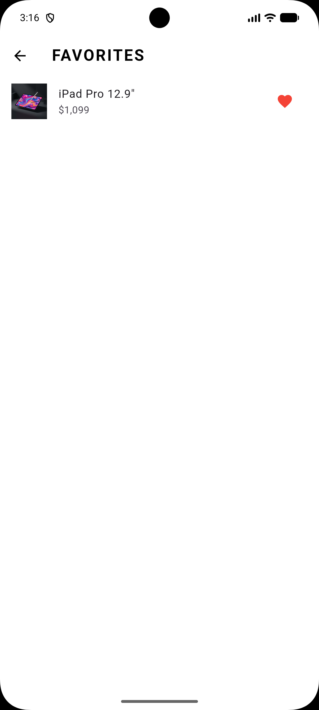 |

### Profil Yönetimi (Profile)
| Profil Paneli | Şifre Değiştirme |
| :---: | :---: |
| 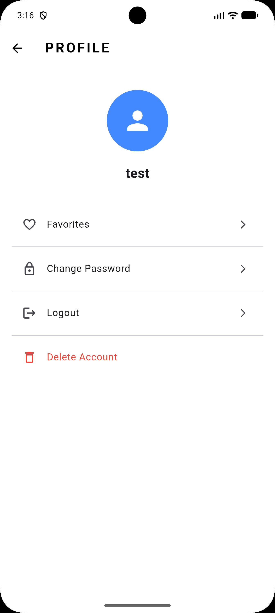 | 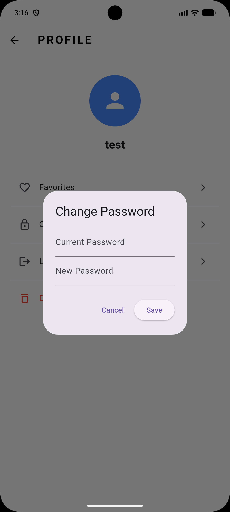 |

---
**Geliştirici:** XFGQ  
**Flutter Sürümü:** 3.x.x
